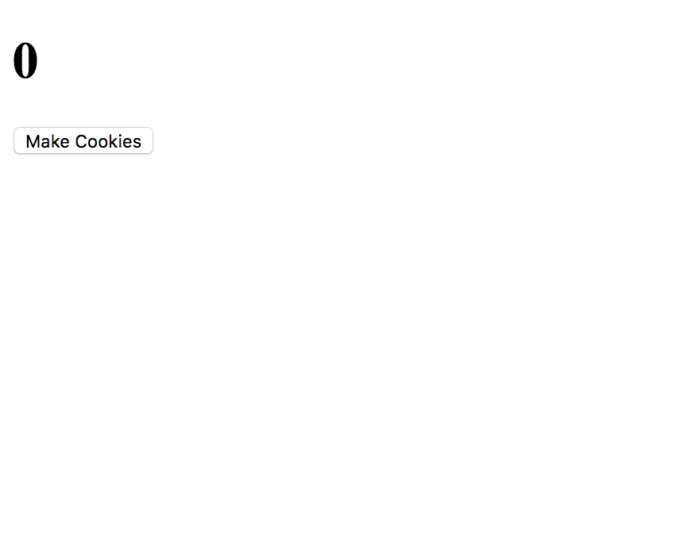

Now that we've created a basic **boilerplate** we are ready to start adding some actual content to our website!

# Laying out our page

First we will start with the first **user story**, which we will recall is:

- As a user, I can click a button to increase the number of cookies I have.

Nested inside the ```<body>``` element please add the following:

```
...
<body>
  <h1>0</h1>
</body>
...
```
We are going to make this ```<h1>``` tag act as our cookie count. We will change the value with Javascript in a later step.

Next we will add in a button:
```
...
  <h1>0</h1>
  <button>Make Cookies</button>
...
```
We now have an element for our Cookie Count, as well as an element that helps us increment our cookies.

Since we have some basic markup for our game. Let's take a quick look at it.

# Checking our work

In order to view our beautiful new website, we need to open up **index.html** inside of a web browser.

To do this, all we need to do is go inside of our terminal and run:

```
open index.html
```

You should see something that looks like this:



## It's javascript time!

Now that we've finished creating our basic markup, we're ready to start adding some functionality to make our game work.

In the last step we created an element that will display how many cookies we have and a button with no functionality.

In this part of the tutorial we will be getting that button to work!

# Adding ID's to elements

In order to interact with the **DOM** in Javascript, we first need to give the elements we want to interact with **unique ID's** that we can target in javascript.

Inside of index.html, let's locate our ```<h1>``` and ```<button>``` elements.

```
<h1>0</h1>
<button>Make Cookies</button>
```

In javascript we tend to use **camelCase** to name our variables. When we add ID's in our markup, in order to prevent any confusion, we use **kabob case**! Kabob-case-looks-like-this, and it's called **kabob case** because it look like we're sticking words together on a stick.

So let's append the following unique ID's to our elements:

```html
<h1 id="cookie-counter">0</h1>
<button id="cookie-clicker">Make Cookies</button>
```

*Great!* Next we will add a bit of Javascript to track our cookies.

# Tracking our cookies!

Inside of *index.html*, right before the closing ```</body>``` tag, we will add in a ```<script>``` tag.

This is where we will put our Javascript code for now.

```
...

  <script>

  </script>
</body>
```

We always put our script tags at the bottom of our page because we want to **make sure the browser loads all of our Javascript after it renders the entire page.**

Once we've done that we're ready to start coding some basic javascript.

The first thing we should do is set the *default value* of our cookie count to a **variable**.

In this case, **our default value is 0, because we start off with 0 cookies**.

Nested inside of the ```<script>``` element, let's add the following lines of code:

```
//declare default variables
let cookieCount = 0;
```

Now we need to set the value of our ```<h1>``` tag *to be equal to* the value of our ```cookieCount``` variable.

We will do this by assigning a variable for that specific h1 tag, and then setting it's **inner HTML** equal to our ```cookieCount```.

```js
<script>
  //set default values
  let cookieCount = 0;

  //declare DOM variables
  let cookieCounter = document.getElementById('cookie-counter');

  cookieCounter.innerHTML = cookieCount;
</script>

```

We can test if this works by changing the value of ```cookieCount``` from 0, to another number, refreshing our page, and looking for a change. Give it a try before moving on.

# Make Some Cookies!

Now that we are tracking our ```cookieCount```, we can make clicking the button increment the amount of cookies we have by 1.

First, we should **create a variable** that **sets how many cookies will be created per click**, and a **variable that selects the element**.

```
  ...

  //set default values
  let cookieCount = 0;
  let clickPower = 1;

  //declare DOM variables
  let cookieCounter = document.getElementById('cookie-counter');
  let cookieClicker = document.getElementById('cookie-clicker');

  ...
</script>

```

Now we can add an **event listener** that executes some code every time a user clicks on the button.

Add the following lines of code right before the closing ```<script>``` tag.

```
...

  //everytime a user clicks the button, their cookies are increased by the value of their clickPower.
  cookieClicker.addEventListener("click", function() {
    cookieCount = cookieCount + clickPower;
    cookieCounter.innerHTML = cookieCount;
  })

</script>
```

If we click our button on the webpage, we should see our number increment by 1. Feel free to change the value of ```clickPower``` to a larger number to go up more than one.

# Onward

Now that we've finished our first **user story** We now have a very simple cookie clicker. It isn't very fun yet though, and players don't have much of an objective.

In the next section we will add a way to increase our clickPower!
