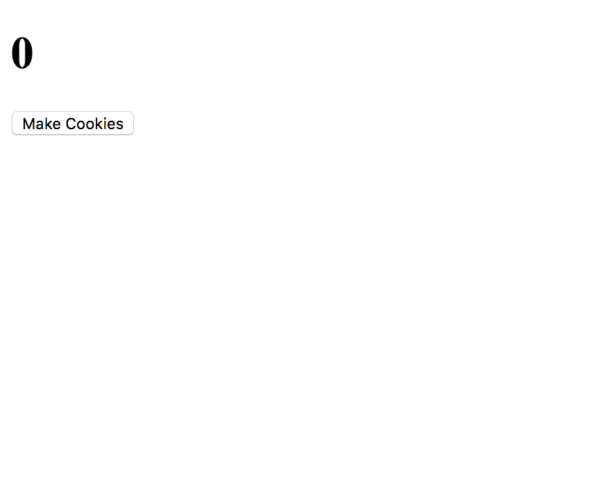

Now that we've created our files, we're ready to open our ovens and get to coding.

# HTML Template

The first thing we're going to do is add in a basic HTML Template.

Inside of index.html, please write the following:

```
<!DOCTYPE html>
<html>
  <head>
    <meta charset="utf-8">
    <title>Make Cookies</title>
  </head>
  <body>

  </body>
</html>
```
Once we have our basic boilerplate we're ready to start laying out our page.

# Laying out our page

We do our initial page layout by thinking about the different types of elements we will need for our webapp.

Some of the things we might need inside of a cookie clicker clone are:

- A counter that displays all of our cookies
- A button that can increase our cookie counter
- A few shop items

As we continue we will discover that we need more components for our game to flourish.

First we will start with the counter. Nested inside the ```<body>``` element please add the following:

```
...
<body>
  <h1>0</h1>
</body>
...
```
We are going to make this ```h1``` tag act as our cookie count. We will change the value with Javascript in a later step.

Next we will add in a button:
```
...
  <h1>0</h1>
  <button>Make Cookies</button>
...
```
We now have an element for our Cookie Count, as well as an element that helps us increment our cookies.

Since we have some basic markup for our game. Let's take a look at it.

# Checking our work

In order to view our beautiful new website, we need to open up index.html inside of a web browser.

To do this, all we need to do is go to our terminal and run:

```
open index.html
```

You should see something that looks like this:



# The end

Now that we've finished creating our basic markup, we're ready to start adding some functionality to make our game work.
