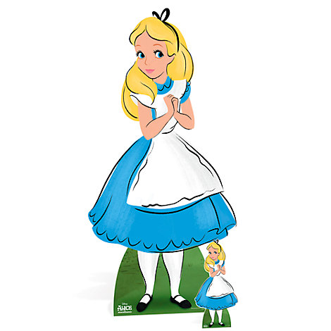

In the last section we finished our facility and published our initial product.

However, we discovered that leveling up our shop items past a certain point no longer becomes useful. The cost of upgrading our products isn't worth the power we recieve.

In this section, we will fix that.

# End game user stories
We need to pay special attention to our users that use our products the most, which is why we develop **Power User Stories**.

Let's define the one we will focus on in this session:

- As a power user, everytime I upgrade an item, the power it gets is correlated directly by it's level.

So let's get right into business.

# Scaling the game!

All we have to do is adjust how much the power level increases with each level.

Let's start with our click power function:

```js

buyClickPower.addEventListener("click", function() {
  ...
    //update Click Power
    clickPower += 1 * Math.floor(clickPowerLevelNumber * 1.05);
  ...  
})

```
And that's it. That's all we have to add to our functions.

Let's go ahead and add them to the others:

```js
...
//buy a grandma
buyGrandma.addEventListener("click", function() {
  ...
    //update grandma power
    grandmaPower += 10 + Math.floor(grandmaLevelNumber * 1.33);
  ...
})

  ...

//buy a facility
buyFacility.addEventListener("click", function() {
  ...
    //update facility power
    facilityPower += 600 + Math.floor(facilityLevelNumber * 1.33);;
  ...
})
...

```

And that should be good.

# Not done yet?
In order to complete this tutorial, you will need to create a shop item (or two) on your own.

Make your names unique, and adjust the prices and power levels so there's things to do after purchasing the cookie manufacturing facility.

## Stretch Challange
Add some custom CSS to make your cookie clicker beautiful.

# Onward?

  
“Would you tell me, please, which way I ought to go from here?"    
"That depends a good deal on where you want to get to," said the Cat.  
"I don't much care where -" said Alice.  
"Then it doesn't matter which way you go," said the Cat.  

"- so long as I get SOMEWHERE," Alice added as an explanation.  
"Oh, you're sure to do that," said the Cat, "if you only walk long enough.”  
― Lewis Carroll, Alice in Wonderland  

You're on the right path, so let's keep on walking.

By completing this tutorial you should have some basic vanilla JavaScript DOM manipulation skills that will serve you handy in future projects.
